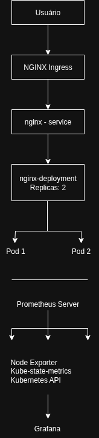
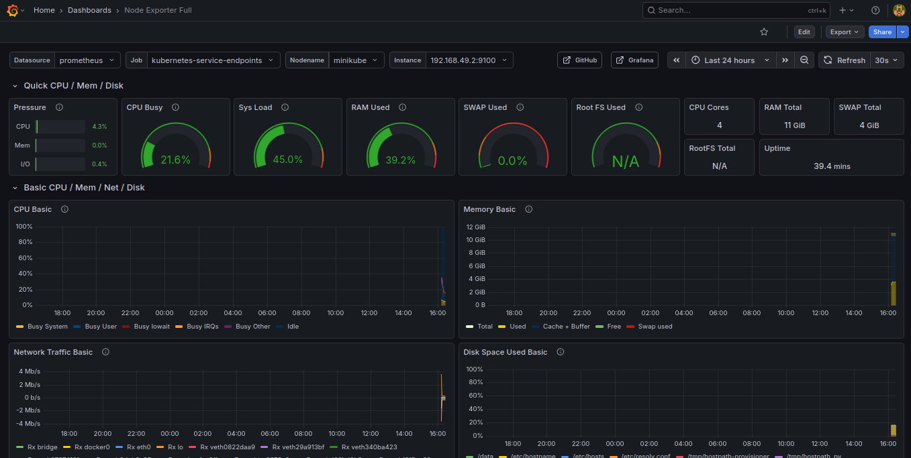
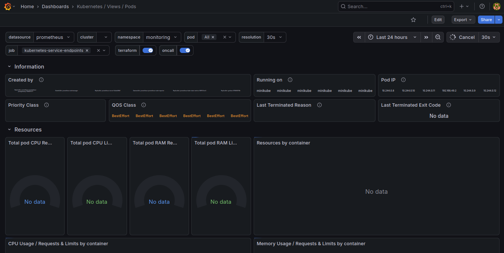
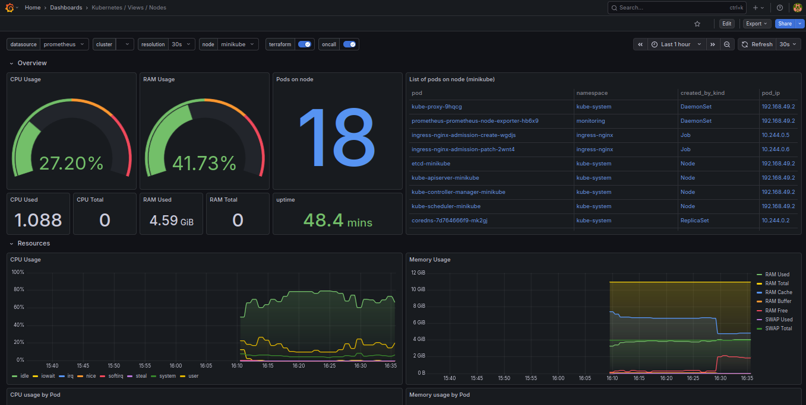
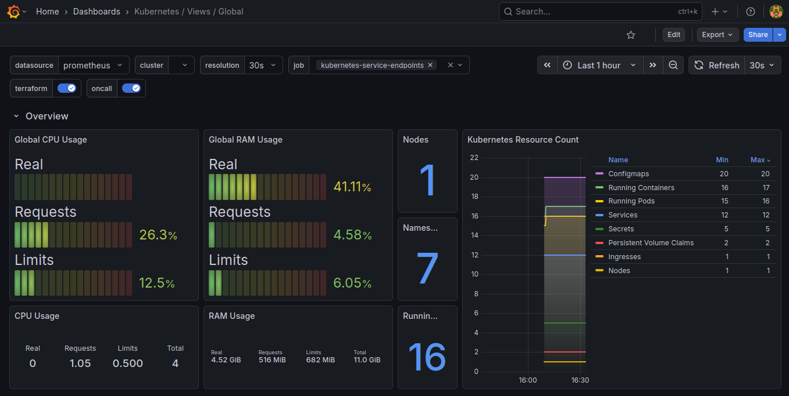

# 🚀 Local Kubernetes Platform


Plataforma Kubernetes local construída com **Minikube**, **NGINX Ingress Controller**, **Prometheus** e **Grafana**, demonstrando práticas modernas de **DevOps**, **Observabilidade** e **Platform Engineering**.

---

# 📖 Sobre o Projeto

Este projeto foi desenvolvido com o objetivo de simular uma plataforma Kubernetes completa em ambiente local, permitindo o deploy de aplicações, exposição de serviços através de Ingress e monitoramento da infraestrutura utilizando Prometheus e Grafana.

A implementação demonstra conceitos essenciais utilizados em ambientes corporativos e plataformas cloud-native.

---

# 🎯 Objetivos

* Implantar aplicações em Kubernetes
* Configurar Namespaces para isolamento de recursos
* Expor aplicações utilizando NGINX Ingress Controller
* Aplicar Requests e Limits de CPU e Memória
* Implementar monitoramento com Prometheus
* Visualizar métricas utilizando Grafana
* Demonstrar automação através de scripts
* Aplicar boas práticas de organização de projetos DevOps

---

# 🏗️ Arquitetura

## Arquitetura Visual



### Documentação complementar

📄 Consulte também:

```text
docs/architecture/architecture.md
```

---

# 📊 Dashboards

Para monitoramento da plataforma foram utilizados dashboards amplamente adotados pela comunidade Kubernetes e Grafana.

---

## Node Exporter Full

Dashboard para monitoramento detalhado dos recursos do sistema operacional.

Dashboard Oficial:

https://grafana.com/grafana/dashboards/1860-node-exporter-full/

### Métricas monitoradas

* CPU
* Memória
* Disco
* Rede
* Sistema Operacional



---

## Kubernetes Cluster Monitoring

Dashboard utilizado para visualização geral do cluster Kubernetes.

Dashboard Oficial:

https://grafana.com/grafana/dashboards/7249-kubernetes-cluster-monitoring/

### Métricas monitoradas

* Saúde do Cluster
* Consumo de Recursos
* Estado dos Workloads
* Componentes Kubernetes



---

## Kubernetes Views - Nodes

Dashboard para monitoramento dos nós do cluster.

Dashboard Oficial:

https://grafana.com/grafana/dashboards/15759-kubernetes-views-nodes/

### Métricas monitoradas

* CPU por Nó
* Memória por Nó
* Pods por Nó
* Utilização de Recursos



---

## Kubernetes Views - Pods

Dashboard para monitoramento dos Pods e Containers.

Dashboard Oficial:

https://grafana.com/grafana/dashboards/15757-kubernetes-views-pods/

### Métricas monitoradas

* Consumo de CPU
* Consumo de Memória
* Reinicializações
* Estado dos Pods
* Containers em execução



---

# 🛠️ Tecnologias Utilizadas

| Categoria              | Tecnologia         |
| ---------------------- | ------------------ |
| Sistema Operacional    | Ubuntu 26.04 LTS   |
| Containers             | Docker             |
| Cluster Kubernetes     | Minikube           |
| Orquestração           | Kubernetes         |
| Gerenciador de Pacotes | Helm               |
| Ingress Controller     | NGINX Ingress      |
| Monitoramento          | Prometheus         |
| Visualização           | Grafana            |
| Métricas do Cluster    | kube-state-metrics |
| Métricas dos Nós       | Node Exporter      |
| Controle de Versão     | Git                |
| Hospedagem de Código   | GitHub             |
| Metricas Kubernetes    | Metrics Server     |

---

# 📂 Estrutura do Projeto

```text
.
├── docs
│   ├── architecture
│   │   └── architecture.md
│   └── screenshots
│       ├── grafana-k8s-cluster.png
│       ├── grafana-k8s-nodes.png
│       ├── grafana-k8s-pods.png
│       └── grafana-node-exporter.png
│
├── kubernetes
│   ├── deployments
│   │   └── nginx-deployment.yaml
│   ├── ingress
│   │   └── nginx-ingress.yaml
│   ├── monitoring
│   │   ├── grafana
│   │   ├── prometheus
│   ├── namespaces
│   │   └── development-namespace.yaml
│   └── services
│       └── nginx-service.yaml
│
├── scripts
│   ├── deploy.sh
│   └── destroy.sh
│
├── terraform
│   ├── helm
│   ├── kind-cluster
│   └── kubernetes-resources
│
├── README.md
├── LICENSE
└── .gitignore
```

---

# ☸️ Recursos Kubernetes

### Namespace

```text
development
```

### Deployment

```text
nginx-deployment
```

Características:

* 2 Réplicas
* Rolling Update
* Resource Requests
* Resource Limits

### Service

```text
nginx-service
```

Tipo:

```text
ClusterIP
```

### Ingress

```text
nginx-ingress
```

Host configurado:

```text
local-app.dev
```

---

# ⚙️ Gerenciamento de Recursos

```yaml
resources:
  requests:
    cpu: "100m"
    memory: "128Mi"

  limits:
    cpu: "250m"
    memory: "256Mi"
```

---

# 🚀 Implantação

## Criar Namespace

```bash
kubectl apply -f kubernetes/namespaces/development-namespace.yaml
```

## Implantar Aplicação

```bash
kubectl apply -f kubernetes/deployments/nginx-deployment.yaml
```

## Criar Service

```bash
kubectl apply -f kubernetes/services/nginx-service.yaml
```

## Criar Ingress

```bash
kubectl apply -f kubernetes/ingress/nginx-ingress.yaml
```

---

# 🤖 Scripts de Automação

## Deploy Completo

```bash
./scripts/deploy.sh
```

## Remover Recursos

```bash
./scripts/destroy.sh
```

---

# 📈 Monitoramento

### Prometheus

Responsável pela coleta de métricas de:

* Kubernetes
* kube-state-metrics
* node-exporter
* Serviços monitorados

### Grafana

Responsável pela visualização das métricas através de dashboards interativos.

Dashboards utilizados:

* Node Exporter Full
* Kubernetes Cluster Monitoring
* Kubernetes Views Nodes
* Kubernetes Views Pods

---

# 💡 Competências Demonstradas

* Kubernetes
* Docker
* Minikube
* Helm
* NGINX Ingress Controller
* Kubernetes Networking
* Resource Management
* Prometheus
* Grafana
* Observabilidade
* Monitoramento
* Infraestrutura como Código
* DevOps
* Platform Engineering
* Metrics Server
* Capacity Planning
* Resource Monitoring
* Performance Analysis

---

# 🔮 Próximos Passos

Possíveis evoluções para o projeto:

* ArgoCD
* GitOps
* Horizontal Pod Autoscaler (HPA)
* Certificados TLS
* Loki
* Promtail
* Centralização de Logs
* GitHub Actions
* CI/CD
* Ambientes Dev, Homologação e Produção

---

# 🔧 Troubleshooting

Documentação de troubleshooting:

docs/troubleshooting/common-issues.md

Contém procedimentos para diagnóstico de:

- Pods
- Services
- Ingress
- Prometheus
- Grafana
- Recursos do Cluster

---

# 📚 Referências

* Kubernetes — https://kubernetes.io
* Minikube — https://minikube.sigs.k8s.io
* Docker — https://www.docker.com
* Helm — https://helm.sh
* Prometheus — https://prometheus.io
* Grafana — https://grafana.com
* NGINX Ingress Controller — https://kubernetes.github.io/ingress-nginx
* Node Exporter — https://github.com/prometheus/node_exporter
* kube-state-metrics — https://github.com/kubernetes/kube-state-metrics

---

# 👨‍💻 Autor

**Daniel Viana**

* GitHub: https://github.com/danielviana2127
* LinkedIn: https://linkedin.com/in/daniel-viana-devops

Profissional em transição para as áreas de DevOps, Cloud Computing e Platform Engineering, com experiência em infraestrutura, suporte técnico e projetos práticos utilizando Kubernetes, Docker, Prometheus, Grafana e automação.

---

⭐ Caso este projeto tenha sido útil, considere deixar uma estrela no repositório.
