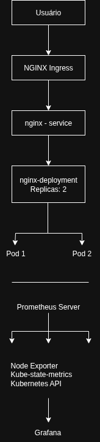
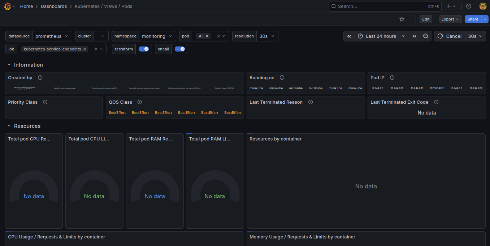
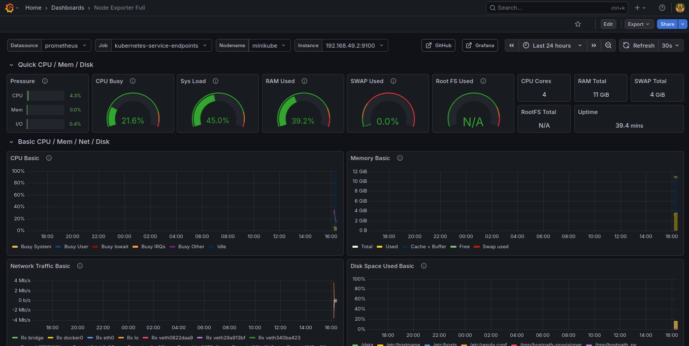
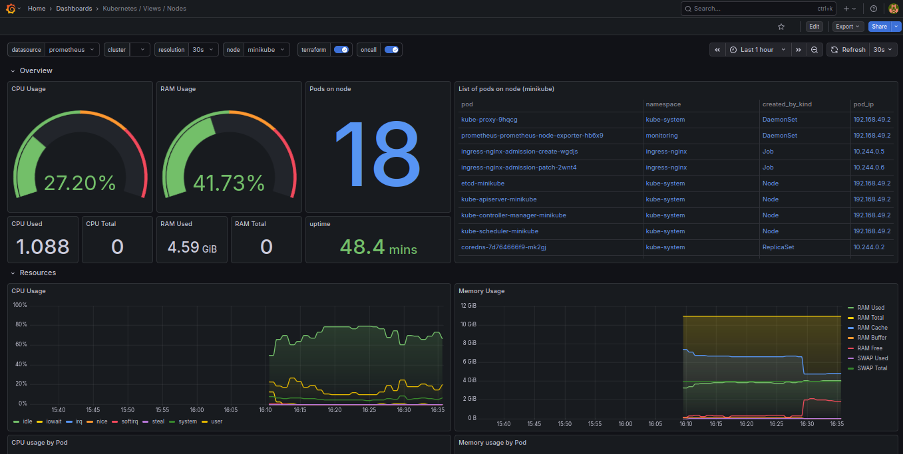
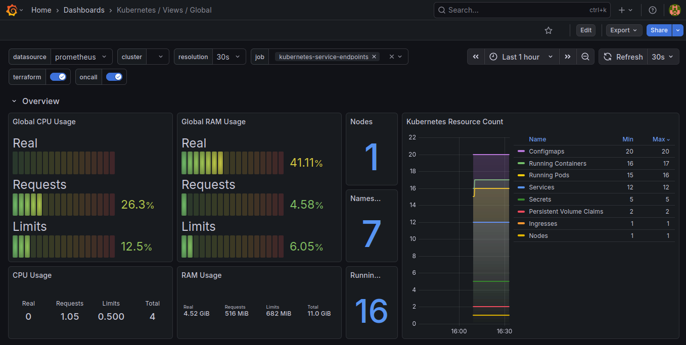

# 🚀 Local Kubernetes Platform


Plataforma Kubernetes local construída com **Minikube**, **NGINX Ingress Controller**, **Prometheus** e **Grafana**, demonstrando práticas de **DevOps**, **Observabilidade** e **Platform Engineering**.

---

## 📖 Sobre o Projeto

Este projeto simula uma plataforma Kubernetes em ambiente local: deploy de aplicações, exposição de serviços através de Ingress e monitoramento da infraestrutura com Prometheus e Grafana.

## 🎯 Objetivos

- Implantar aplicações em Kubernetes
- Configurar Namespaces para isolamento de recursos
- Expor aplicações utilizando NGINX Ingress Controller
- Aplicar Requests e Limits de CPU e Memória
- Configurar probes de readiness e liveness
- Implementar monitoramento com Prometheus
- Visualizar métricas utilizando Grafana
- Automatizar a implantação através de scripts

---

## 🏗️ Arquitetura



Diagramas detalhados em [`docs/architecture/architecture.md`](docs/architecture/architecture.md).

---

## 🛠️ Tecnologias Utilizadas

| Categoria              | Tecnologia         |
| ---------------------- | ------------------ |
| Sistema Operacional    | Ubuntu 26.04 LTS   |
| Containers             | Docker             |
| Cluster Kubernetes     | Minikube           |
| Gerenciador de Pacotes | Helm               |
| Ingress Controller     | NGINX Ingress      |
| Monitoramento          | Prometheus         |
| Visualização           | Grafana            |
| Métricas do Cluster    | kube-state-metrics |
| Métricas dos Nós       | Node Exporter      |
| Métricas de Recursos   | Metrics Server     |
| Controle de Versão     | Git / GitHub       |

---

## 📂 Estrutura do Projeto

```
.
├── docs
│   ├── architecture
│   │   └── architecture.md
│   └── screenshots
│       ├── platform-architecture.png
│       ├── grafana-k8s-cluster.png
│       ├── grafana-k8s-nodes.png
│       ├── grafana-k8s-pods.png
│       └── grafana-node-exporter.png
│
├── kubernetes
│   ├── deployments
│   │   └── nginx-deployment.yaml
│   ├── ingress
│   │   └── nginx-ingress.yaml
│   ├── monitoring
│   │   ├── grafana
│   │   └── prometheus
│   ├── namespaces
│   │   └── development-namespace.yaml
│   └── services
│       └── nginx-service.yaml
│
├── scripts
│   ├── deploy.sh
│   ├── destroy.sh
│   └── install-monitoring.sh
│
├── LICENSE
├── README.md
└── .gitignore
```

---

## ☸️ Recursos Kubernetes

| Recurso    | Nome               | Detalhes                                                                  |
| ---------- | ------------------ | ------------------------------------------------------------------------- |
| Namespace  | `development`      | Isolamento da aplicação                                                   |
| Deployment | `nginx-deployment` | 2 réplicas, RollingUpdate, requests/limits, readiness e liveness probes   |
| Service    | `nginx-service`    | Tipo ClusterIP, porta 80                                                  |
| Ingress    | `nginx-ingress`    | Host `local-app.dev`, classe `nginx`                                      |

### Gerenciamento de Recursos

```yaml
resources:
  requests:
    cpu: "100m"
    memory: "128Mi"
  limits:
    cpu: "250m"
    memory: "256Mi"
```

---

## ✅ Pré-requisitos

- Docker
- [Minikube](https://minikube.sigs.k8s.io/docs/start/)
- [kubectl](https://kubernetes.io/docs/tasks/tools/)
- [Helm](https://helm.sh/docs/intro/install/)

---

## 🚀 Como Executar

### 1. Iniciar o cluster

```bash
minikube start --driver=docker
```

### 2. Clonar o repositório

```bash
git clone https://github.com/danielviana2127/local-kubernetes-platform.git
cd local-kubernetes-platform
```

### 3. Implantar a aplicação

O script habilita o NGINX Ingress, aplica os manifests e aguarda o deployment ficar pronto:

```bash
./scripts/deploy.sh
```

Para aplicar manualmente, na ordem:

```bash
kubectl apply -f kubernetes/namespaces/
kubectl apply -f kubernetes/deployments/
kubectl apply -f kubernetes/services/
kubectl apply -f kubernetes/ingress/
```

### 4. Acessar a aplicação

Adicione o host ao `/etc/hosts`:

```bash
echo "$(minikube ip) local-app.dev" | sudo tee -a /etc/hosts
```

Teste:

```bash
curl http://local-app.dev
```

> **Driver Docker:** se o IP do Minikube não for acessível, rode `minikube tunnel` em outro terminal e use `127.0.0.1 local-app.dev` no `/etc/hosts`.
>
> **Navegador:** o domínio `.dev` força HTTPS nos navegadores. Para testar via navegador, use `curl` ou troque o host por `local-app.local` no Ingress.

### 5. Instalar o monitoramento

```bash
./scripts/install-monitoring.sh
```

O script habilita o Metrics Server e instala o `kube-prometheus-stack` (Prometheus, Grafana, kube-state-metrics e node-exporter) no namespace `monitoring`.

Acessar o Grafana:

```bash
kubectl port-forward -n monitoring svc/monitoring-grafana 3000:80
```

Abra `http://localhost:3000` (usuário `admin`). Senha:

```bash
kubectl get secret -n monitoring monitoring-grafana -o jsonpath="{.data.admin-password}" | base64 -d; echo
```

Acessar o Prometheus:

```bash
kubectl port-forward -n monitoring svc/monitoring-kube-prometheus-prometheus 9090:9090
```

### 6. Remover os recursos

```bash
./scripts/destroy.sh
```

---

## 📊 Dashboards

Dashboards da comunidade importados no Grafana (**Dashboards → New → Import**, informando o ID):

| Dashboard                     | ID    | Link                                                                    |
| ----------------------------- | ----- | ----------------------------------------------------------------------- |
| Node Exporter Full            | 1860  | https://grafana.com/grafana/dashboards/1860-node-exporter-full/         |
| Kubernetes Cluster Monitoring | 7249  | https://grafana.com/grafana/dashboards/7249-kubernetes-cluster-monitoring/ |
| Kubernetes Views - Nodes      | 15759 | https://grafana.com/grafana/dashboards/15759-kubernetes-views-nodes/    |
| Kubernetes Views - Pods       | 15757 | https://grafana.com/grafana/dashboards/15757-kubernetes-views-pods/     |

### Kubernetes Cluster Monitoring

Saúde do cluster, consumo de recursos, estado dos workloads e componentes Kubernetes.



### Node Exporter Full

CPU, memória, disco, rede e sistema operacional.



### Kubernetes Views - Nodes

CPU, memória e pods por nó, e utilização de recursos.



### Kubernetes Views - Pods

Consumo de CPU e memória, reinicializações, estado dos pods e containers em execução.



---

## 🔧 Troubleshooting

| Sintoma                                  | Verificação                                                                            |
| ---------------------------------------- | -------------------------------------------------------------------------------------- |
| Pods não iniciam                         | `kubectl get pods -n development` e `kubectl describe pod <pod> -n development`        |
| Aplicação não responde                   | `kubectl get endpoints nginx-service -n development` (vazio = selector não confere)    |
| Ingress sem endereço ou erro 404/503     | `kubectl get pods -n ingress-nginx` e `kubectl describe ingress nginx-ingress -n development` |
| `local-app.dev` não resolve              | Confira a linha no `/etc/hosts` e, com driver Docker, rode `minikube tunnel`           |
| Grafana sem dados                        | Em **Connections → Data sources**, teste o Prometheus; confira `kubectl get pods -n monitoring` |
| `kubectl top` falha                      | `minikube addons enable metrics-server` e aguarde 1–2 minutos                          |

---

## 💡 Competências Demonstradas

- Kubernetes (Deployments, Services, Ingress, Namespaces)
- Docker e Minikube
- Helm
- NGINX Ingress Controller
- Gerenciamento de recursos (requests e limits) e health probes
- Prometheus, Grafana e Observabilidade
- Metrics Server
- Automação com Shell Script
- DevOps e Platform Engineering

---

## 🔮 Próximos Passos

- GitHub Actions: validação dos manifests (kubeconform)
- Horizontal Pod Autoscaler (HPA)
- Certificados TLS
- ArgoCD e GitOps
- Loki e Promtail para centralização de logs
- Alertas no Prometheus (Alertmanager)
- Ambientes Dev, Homologação e Produção

---

## 📚 Referências

- [Kubernetes](https://kubernetes.io)
- [Minikube](https://minikube.sigs.k8s.io)
- [Docker](https://www.docker.com)
- [Helm](https://helm.sh)
- [Prometheus](https://prometheus.io)
- [Grafana](https://grafana.com)
- [NGINX Ingress Controller](https://kubernetes.github.io/ingress-nginx)
- [kube-prometheus-stack](https://github.com/prometheus-community/helm-charts/tree/main/charts/kube-prometheus-stack)
- [Node Exporter](https://github.com/prometheus/node_exporter)
- [kube-state-metrics](https://github.com/kubernetes/kube-state-metrics)

---

## 👨‍💻 Autor

**Daniel Viana**

- GitHub: <https://github.com/danielviana2127>
- LinkedIn: <https://linkedin.com/in/daniel-viana-devops>

Profissional em transição para as áreas de DevOps, Cloud Computing e Platform Engineering, com experiência em infraestrutura, suporte técnico e projetos práticos utilizando Kubernetes, Docker, Prometheus, Grafana e automação.

---

⭐ Caso este projeto tenha sido útil, considere deixar uma estrela no repositório.