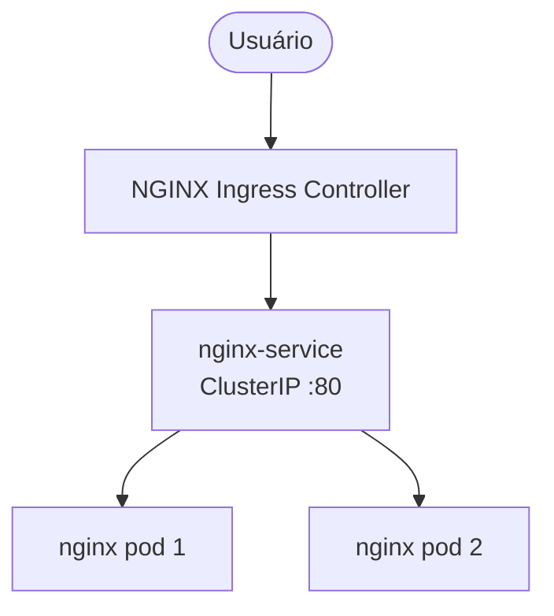
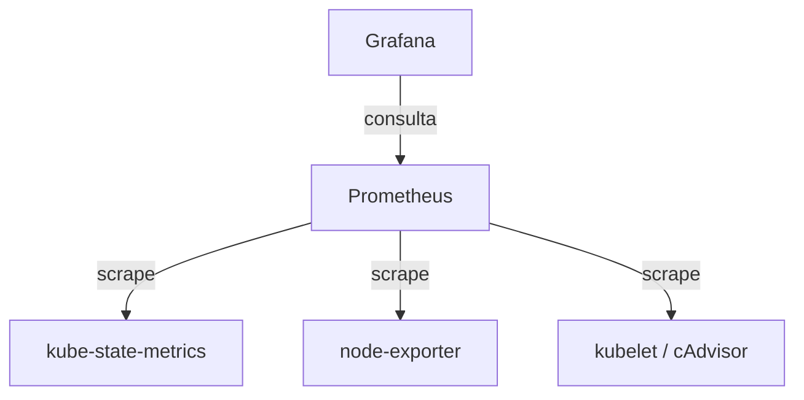

# Arquitetura

Visão geral da plataforma Kubernetes local executada em Minikube.

## Fluxo de requisições

- Namespace da aplicação: `development`
- Host configurado no Ingress: `local-app.dev`
- Deployment com 2 réplicas, RollingUpdate e probes de readiness/liveness

## Fluxo de monitoramento

- Namespace do monitoramento: `monitoring`
- Instalado via Helm com o chart `kube-prometheus-stack`
- Grafana lê o Prometheus como data source e exibe os dashboards importados

## Componentes

| Componente         | Função                                             | Namespace        |
| ------------------ | -------------------------------------------------- | ---------------- |
| NGINX Ingress      | Entrada HTTP do cluster                            | `ingress-nginx`  |
| nginx (app)        | Aplicação de exemplo                               | `development`    |
| Prometheus         | Coleta e armazena métricas                         | `monitoring`     |
| Grafana            | Visualização de métricas                           | `monitoring`     |
| kube-state-metrics | Métricas do estado dos objetos Kubernetes          | `monitoring`     |
| node-exporter      | Métricas do sistema operacional dos nós            | `monitoring`     |
| Metrics Server     | Métricas de recursos para `kubectl top` e HPA      | `kube-system`    |